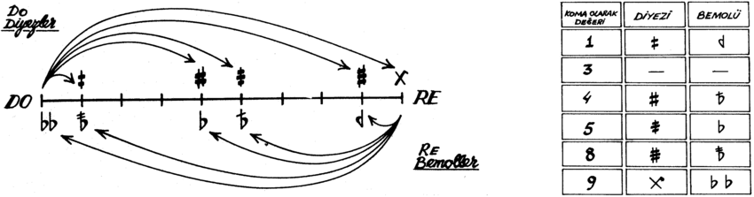

# Turkish Makam Music XML Parser



This repository contains a parser designed specifically for parsing Turkish Makam Music (TMM) from MusicXML files. The parser is tailored to handle the [SymbTr dataset](https://github.com/MTG/SymbTr).

To accommodate Holdrian commas, the parser first updates alter values present in MusicXML, according to the accidental name. In TMM, a tone is divided into 9 intervals, hence alter values range from -9 to +9.

To avoid error when parsing with music21, key signatures are removed from the MusicXML files. The current implementation of music21 does not support non-western accidental types.

Finally, the parser adjusts microtone values for pitches, based on the alter value. The adjustment is made in cents.

## Setup
```bash
pip install music21
```

Clone the dataset in the parent directory as well.

```bash
git clone https://github.com/MTG/SymbTr.git
```

If the datset location is different, set the correct path in `demo.ipynb` file.

## Usage
```python
from TMMFix.parse_makam_xml import fix_m21_parsing_makam

FILE_NAME = "hicaz--sarki--aksaksemai--sezdim_dargin--rifat_ayaydin.xml"

m21_stream_score = fix_m21_parsing_makam(FILE_NAME)
```

## External Links
- https://github.com/MTG/SymbTr
- https://github.com/burakuyar/MusicXMLConverter
- https://github.com/cuthbertLab/music21