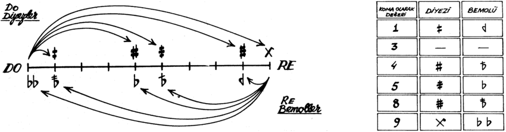

# makam-parser


## Usage

You can parse a makam musicx-xml file by running `parse_makam_xml.py`:

#### Originally, this was the mapping from accidental name to alter value:

```
altervalues = {
    "quarter-flat": "-0.5",
    "slash-flat": None,
    "flat": "-1",
    "double-slash-flat": None,
    "quarter-sharp": "+0.5",
    "slash-sharp": None,
    "sharp": "+1",
    "slash-quarter-sharp": None,
}
```

#### This parser will use the following mapping allowing for microtonal intervals.
```
altervalues = {
    "flat": -9,
    "sharp": +9,
    "quarter-flat": -4,
    "quarter-sharp": +4,
    "slash-flat": -5,
    "slash-quarter-sharp": +5,
    "double-slash-flat": -8,
    "slash-sharp": +8,
}

```

## External Links
- https://github.com/MTG/SymbTr
- https://github.com/burakuyar/MusicXMLConverter

